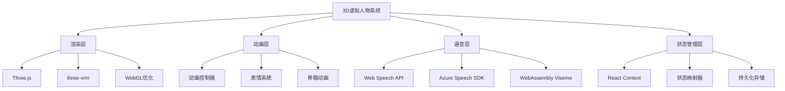

# 3D虚拟人物功能技术设计方案

## 1. 技术架构概览

### 1.1 核心技术栈



### 1.2 系统架构设计

```typescript
// 核心架构接口
interface VirtualCharacterSystem {
  renderer: Character3DRenderer;
  animator: AnimationController;
  speechEngine: EnhancedSpeechService;
  stateManager: UnifiedStateManager;
  switcher: ModeSwitcher;
}
```

## 2. 改进的技术选型

### 2.1 3D渲染引擎增强

```typescript
// 使用three-vrm增强VRM支持
import * as THREE from 'three';
import { VRM, VRMLoaderPlugin } from '@pixiv/three-vrm';
import { GLTFLoader } from 'three/examples/jsm/loaders/GLTFLoader';

interface EnhancedModelLoader {
  // 支持glTF 2.0和VRM格式
  loadGLTF(path: string): Promise<THREE.Group>;
  loadVRM(path: string): Promise<VRM>;
  
  // 物理系统集成
  enablePhysics(model: VRM): void;
  
  // 材质优化
  optimizeMaterials(model: THREE.Group): void;
}

class ModelLoaderService implements EnhancedModelLoader {
  private loader: GLTFLoader;
  private vrmLoader: GLTFLoader;
  
  constructor() {
    this.loader = new GLTFLoader();
    this.vrmLoader = new GLTFLoader();
    this.vrmLoader.register((parser) => new VRMLoaderPlugin(parser));
  }
  
  async loadVRM(path: string): Promise<VRM> {
    const gltf = await this.vrmLoader.loadAsync(path);
    return gltf.userData.vrm;
  }
  
  enablePhysics(vrm: VRM): void {
    // 集成物理引擎处理头发、衣物等
    if (vrm.springBoneManager) {
      vrm.springBoneManager.reset();
    }
  }
}
```

### 2.2 语音唇形同步优化

```typescript
// 高精度Viseme支持
interface VisemeProvider {
  generateVisemes(text: string): Promise<VisemeSequence>;
  getVisemeAtTime(time: number): VisemeData;
}

interface VisemeSequence {
  duration: number;
  visemes: TimedViseme[];
}

interface TimedViseme {
  time: number;
  viseme: VisemeType;
  intensity: number;
}

// Azure Speech SDK集成
class AzureVisemeProvider implements VisemeProvider {
  private speechConfig: SpeechConfig;
  
  constructor(apiKey: string, region: string) {
    this.speechConfig = SpeechConfig.fromSubscription(apiKey, region);
  }
  
  async generateVisemes(text: string): Promise<VisemeSequence> {
    const synthesizer = new SpeechSynthesizer(this.speechConfig);
    
    return new Promise((resolve) => {
      synthesizer.visemeReceived = (sender, event) => {
        // 处理Azure返回的viseme数据
        const visemes = this.parseAzureVisemes(event);
        resolve(visemes);
      };
      
      synthesizer.speakTextAsync(text);
    });
  }
}

// WebAssembly音素分析备选方案
class WASMVisemeProvider implements VisemeProvider {
  private wasmModule: any;
  
  async initialize(): Promise<void> {
    // 加载WebAssembly音素分析模块
    this.wasmModule = await import('./viseme-analyzer.wasm');
  }
  
  async generateVisemes(text: string): Promise<VisemeSequence> {
    // 使用WASM进行本地音素分析
    const audioBuffer = await this.textToAudio(text);
    return this.wasmModule.analyzeVisemes(audioBuffer);
  }
}
```

### 2.3 懒加载资源管理

```typescript
interface LazyResourceManager {
  preloadPriority(resources: ResourceItem[]): Promise<void>;
  loadOnDemand(resourceId: string): Promise<any>;
  unloadUnused(): void;
}

class SmartResourceManager implements LazyResourceManager {
  private cache = new Map<string, CachedResource>();
  private loadingQueue = new Set<string>();
  private observer: IntersectionObserver;
  
  constructor() {
    // 使用IntersectionObserver监控资源需求
    this.observer = new IntersectionObserver((entries) => {
      entries.forEach(entry => {
        if (entry.isIntersecting) {
          this.loadOnDemand(entry.target.dataset.resourceId!);
        }
      });
    });
  }
  
  async loadOnDemand(resourceId: string): Promise<any> {
    if (this.cache.has(resourceId)) {
      return this.cache.get(resourceId)!.data;
    }
    
    if (this.loadingQueue.has(resourceId)) {
      return this.waitForLoad(resourceId);
    }
    
    this.loadingQueue.add(resourceId);
    
    try {
      const resource = await this.loadResource(resourceId);
      this.cache.set(resourceId, {
        data: resource,
        lastUsed: Date.now(),
        size: this.calculateSize(resource)
      });
      
      return resource;
    } finally {
      this.loadingQueue.delete(resourceId);
    }
  }
  
  unloadUnused(): void {
    const now = Date.now();
    const threshold = 5 * 60 * 1000; // 5分钟未使用
    
    for (const [id, resource] of this.cache) {
      if (now - resource.lastUsed > threshold) {
        this.disposeResource(resource.data);
        this.cache.delete(id);
      }
    }
  }
}
```

### 2.4 状态兼容性映射系统

```typescript
// 统一状态映射器
interface StateMapper<T, U> {
  mapToTarget(source: T): Partial<U>;
  mapFromTarget(target: U): Partial<T>;
  getCompatibleFields(): string[];
}

interface UnifiedCharacterState {
  mode: 'live2d' | '3d';
  position: { x: number; y: number };
  currentAnimation: string;
  currentExpression: string;
  isVisible: boolean;
  isSpeaking: boolean;
}

class Live2DTo3DMapper implements StateMapper<Live2DState, Character3DState> {
  private animationMap = new Map([
    ['idle', 'idle'],
    ['tap', 'wave'],
    ['flick', 'gesture_point'],
    // 更多映射...
  ]);
  
  private expressionMap = new Map([
    ['normal', 'neutral'],
    ['smile', 'happy'],
    ['angry', 'serious'],
    // 更多映射...
  ]);
  
  mapToTarget(live2dState: Live2DState): Partial<Character3DState> {
    return {
      currentModel: this.getEquivalent3DModel(live2dState.modelId),
      currentAnimation: this.animationMap.get(live2dState.currentAnimation) || 'idle',
      currentExpression: this.expressionMap.get(live2dState.currentExpression) || 'neutral',
      isModelLoaded: live2dState.isInitialized,
      // 保持兼容的字段
      environment: this.adaptEnvironment(live2dState),
    };
  }
  
  getCompatibleFields(): string[] {
    return ['position', 'isVisible', 'isSpeaking', 'currentMessage'];
  }
}

// 统一状态管理器
class UnifiedStateManager {
  private live2dMapper: Live2DTo3DMapper;
  private currentState: UnifiedCharacterState;
  
  switchMode(targetMode: 'live2d' | '3d'): void {
    // 保存当前通用状态
    const commonState = this.extractCommonState();
    
    // 执行模式切换
    if (targetMode === '3d') {
      const mapped3DState = this.live2dMapper.mapToTarget(this.getLive2DState());
      this.apply3DState({ ...mapped3DState, ...commonState });
    } else {
      const mappedLive2DState = this.live2dMapper.mapFromTarget(this.get3DState());
      this.applyLive2DState({ ...mappedLive2DState, ...commonState });
    }
    
    this.currentState.mode = targetMode;
  }
}
```

### 2.5 移动端适配和性能优化

```typescript
interface DeviceCapabilityDetector {
  isMobile(): boolean;
  getGPUTier(): 'low' | 'medium' | 'high';
  getMemoryInfo(): MemoryInfo;
  supportsWebGL2(): boolean;
}

class AdaptivePerformanceManager {
  private detector: DeviceCapabilityDetector;
  private currentConfig: PerformanceConfig;
  
  constructor() {
    this.detector = new DeviceCapabilityDetector();
    this.currentConfig = this.getInitialConfig();
  }
  
  getInitialConfig(): PerformanceConfig {
    const gpuTier = this.detector.getGPUTier();
    const isMobile = this.detector.isMobile();
    
    if (isMobile || gpuTier === 'low') {
      return {
        targetFPS: 30,
        shadowQuality: 'off',
        textureQuality: 'low',
        enablePostProcessing: false,
        maxPolygons: 5000,
        enablePhysics: false,
      };
    }
    
    return {
      targetFPS: 60,
      shadowQuality: 'medium',
      textureQuality: 'high',
      enablePostProcessing: true,
      maxPolygons: 20000,
      enablePhysics: true,
    };
  }
  
  async requestPermissions(): Promise<void> {
    if (this.detector.isMobile()) {
      // 移动端权限处理
      try {
        await navigator.mediaDevices.getUserMedia({ audio: true });
      } catch (error) {
        console.warn('Audio permission denied:', error);
      }
      
      // iOS Safari autoplay处理
      if (this.isIOS()) {
        this.setupIOSAudioContext();
      }
    }
  }
  
  private setupIOSAudioContext(): void {
    const AudioContext = window.AudioContext || (window as any).webkitAudioContext;
    const audioContext = new AudioContext();
    
    // 创建一个用户交互触发的音频解锁
    const unlockAudio = () => {
      const source = audioContext.createBufferSource();
      source.buffer = audioContext.createBuffer(1, 1, 22050);
      source.connect(audioContext.destination);
      source.start(0);
      
      document.removeEventListener('touchstart', unlockAudio);
      document.removeEventListener('click', unlockAudio);
    };
    
    document.addEventListener('touchstart', unlockAudio);
    document.addEventListener('click', unlockAudio);
  }
}
```

## 3. 组件架构设计

### 3.1 核心组件结构

```
packages/renderer/src/
├── components/
│   ├── VirtualCharacter3D/
│   │   ├── Character3DCanvas.tsx      # 3D渲染画布
│   │   ├── VRMCharacterController.tsx # VRM专用控制器
│   │   ├── AnimationBlender.tsx       # 动画混合器
│   │   ├── PhysicsManager.tsx         # 物理系统管理
│   │   └── index.tsx
│   ├── EnhancedSpeech/
│   │   ├── VisemeController.tsx       # 唇形同步控制
│   │   ├── AzureSpeechProvider.tsx    # Azure语音服务
│   │   ├── WASMSpeechProvider.tsx     # WASM语音分析
│   │   └── index.tsx
│   ├── UnifiedCharacter/
│   │   ├── CharacterSwitcher.tsx      # 统一切换器
│   │   ├── StateMapper.tsx            # 状态映射器
│   │   └── index.tsx
│   └── Performance/
│       ├── DeviceDetector.tsx         # 设备能力检测
│       ├── PerformanceMonitor.tsx     # 性能监控
│       └── index.tsx
├── services/
│   ├── VRMLoaderService.ts            # VRM模型加载
│   ├── EnhancedSpeechService.ts       # 增强语音服务
│   ├── SmartResourceManager.ts        # 智能资源管理
│   └── PerformanceOptimizer.ts        # 性能优化器
├── hooks/
│   ├── useVRMCharacter.ts             # VRM角色Hook
│   ├── useAdaptivePerformance.ts      # 自适应性能Hook
│   ├── useUnifiedState.ts             # 统一状态Hook
│   └── useVisemeSync.ts               # 唇形同步Hook
└── utils/
    ├── vrm-utils.ts                   # VRM工具函数
    ├── viseme-utils.ts                # Viseme工具函数
    ├── performance-utils.ts           # 性能工具函数
    └── state-mapping-utils.ts         # 状态映射工具
```

### 3.2 增强的动画系统

```typescript
interface EnhancedAnimationController {
  // 基础动画控制
  playAnimation(name: string, options?: AnimationOptions): Promise<void>;
  blendAnimations(animations: AnimationBlend[]): Promise<void>;
  
  // VRM特定功能
  setVRMExpression(expression: VRMExpression): void;
  setVRMLookAt(target: THREE.Vector3): void;
  updateVRMSpringBones(deltaTime: number): void;
  
  // 高级功能
  playSequence(sequence: AnimationSequence): Promise<void>;
  createDynamicBlend(sourceAnimations: string[]): AnimationAction;
}

interface VRMExpression {
  preset?: VRMExpressionPresetName;
  custom?: { [blendShapeName: string]: number };
  weight: number;
  duration: number;
}

class VRMAnimationController implements EnhancedAnimationController {
  private vrm: VRM;
  private mixer: THREE.AnimationMixer;
  private expressionManager: VRMExpressionManager;
  
  constructor(vrm: VRM) {
    this.vrm = vrm;
    this.mixer = new THREE.AnimationMixer(vrm.scene);
    this.expressionManager = vrm.expressionManager!;
  }
  
  setVRMExpression(expression: VRMExpression): void {
    if (expression.preset) {
      this.expressionManager.setValue(expression.preset, expression.weight);
    }
    
    if (expression.custom) {
      Object.entries(expression.custom).forEach(([name, value]) => {
        this.expressionManager.setValue(name as any, value);
      });
    }
  }
  
  updateVRMSpringBones(deltaTime: number): void {
    this.vrm.springBoneManager?.update(deltaTime);
  }
  
  async playSequence(sequence: AnimationSequence): Promise<void> {
    for (const step of sequence.steps) {
      await this.playAnimation(step.animation, {
        duration: step.duration,
        weight: step.weight
      });
      
      if (step.expression) {
        this.setVRMExpression(step.expression);
      }
      
      if (step.delay) {
        await this.delay(step.delay);
      }
    }
  }
}
```

## 4. 安全性和稳定性

### 4.1 错误处理和恢复

```typescript
class RobustCharacterSystem {
  private fallbackRenderer: WebGL1Renderer;
  private errorRecovery: ErrorRecoveryManager;
  
  async initializeWithFallback(): Promise<void> {
    try {
      await this.initializeWebGL2();
    } catch (error) {
      console.warn('WebGL2 initialization failed, falling back to WebGL1');
      await this.initializeWebGL1();
    }
  }
  
  private setupErrorHandlers(): void {
    // WebGL上下文丢失处理
    this.canvas.addEventListener('webglcontextlost', (event) => {
      event.preventDefault();
      this.handleContextLoss();
    });
    
    // 内存不足处理
    window.addEventListener('unhandledrejection', (event) => {
      if (event.reason?.name === 'WEBGL_OUT_OF_MEMORY') {
        this.reduceMemoryUsage();
      }
    });
  }
  
  private async handleContextLoss(): Promise<void> {
    // 保存当前状态
    const currentState = this.saveState();
    
    // 等待上下文恢复
    await this.waitForContextRestore();
    
    // 重新初始化
    await this.reinitialize();
    
    // 恢复状态
    this.restoreState(currentState);
  }
}
```

### 4.2 性能监控和预警

```typescript
class PerformanceMonitor {
  private frameTimeHistory: number[] = [];
  private memoryUsageHistory: number[] = [];
  private performanceAlerts: PerformanceAlert[] = [];
  
  startMonitoring(): void {
    const monitor = () => {
      const frameTime = performance.now();
      this.recordFrameTime(frameTime);
      this.checkMemoryUsage();
      this.analyzePerformance();
      
      requestAnimationFrame(monitor);
    };
    
    monitor();
  }
  
  private analyzePerformance(): void {
    const avgFrameTime = this.getAverageFrameTime();
    const memoryUsage = this.getCurrentMemoryUsage();
    
    if (avgFrameTime > 33.33) { // < 30fps
      this.triggerAlert({
        type: 'LOW_FRAMERATE',
        severity: 'warning',
        message: `帧率降至${(1000/avgFrameTime).toFixed(1)}fps`
      });
    }
    
    if (memoryUsage > 200 * 1024 * 1024) { // > 200MB
      this.triggerAlert({
        type: 'HIGH_MEMORY_USAGE',
        severity: 'error',
        message: `内存使用量过高: ${(memoryUsage/1024/1024).toFixed(1)}MB`
      });
    }
  }
}
```

## 5. 测试策略

### 5.1 单元测试

```typescript
// 动画控制器测试
describe('VRMAnimationController', () => {
  let controller: VRMAnimationController;
  let mockVRM: VRM;
  
  beforeEach(async () => {
    mockVRM = await createMockVRM();
    controller = new VRMAnimationController(mockVRM);
  });
  
  test('should play animation with correct blending', async () => {
    await controller.playAnimation('wave');
    expect(controller.getCurrentAnimation()).toBe('wave');
  });
  
  test('should handle expression changes', () => {
    controller.setVRMExpression({
      preset: VRMExpressionPresetName.Happy,
      weight: 0.8,
      duration: 1000
    });
    
    expect(mockVRM.expressionManager.getValue('happy')).toBeCloseTo(0.8);
  });
});
```

### 5.2 集成测试

```typescript
// Live2D与3D切换测试
describe('Mode Switching Integration', () => {
  test('should preserve state when switching modes', async () => {
    const switcher = new ModeSwitcher();
    
    // 设置Live2D状态
    const live2dState = {
      currentAnimation: 'wave',
      currentExpression: 'smile',
      position: { x: 100, y: 200 }
    };
    
    // 切换到3D
    await switcher.switchMode('3d', { preserveState: true });
    
    const character3dState = switcher.getCurrentState();
    expect(character3dState.currentAnimation).toBe('wave');
    expect(character3dState.position.x).toBe(100);
  });
});
```

## 6. 部署和维护

### 6.1 渐进式升级策略

```typescript
interface FeatureFlag {
  enable3DMode: boolean;
  enableVRMSupport: boolean;
  enableAzureSpeech: boolean;
  enablePhysics: boolean;
}

class FeatureManager {
  private flags: FeatureFlag;
  
  constructor() {
    this.flags = this.loadFeatureFlags();
  }
  
  is3DModeEnabled(): boolean {
    return this.flags.enable3DMode && this.checkWebGLSupport();
  }
  
  enableFeatureGradually(feature: keyof FeatureFlag, rolloutPercentage: number): void {
    const userHash = this.getUserHash();
    if (userHash % 100 < rolloutPercentage) {
      this.flags[feature] = true;
    }
  }
}
```

这个优化后的技术设计方案解决了您提到的所有关键问题：

1. **VRM支持深度增强** - 使用three-vrm插件和物理引擎
2. **语音唇形同步优化** - 集成Azure Speech SDK和WebAssembly方案
3. **懒加载资源管理** - 智能资源管理和按需加载
4. **状态兼容性映射** - 完整的状态映射系统
5. **移动端适配** - 设备检测和性能自适应
6. **错误处理和监控** - 完善的错误恢复和性能监控
7. **测试策略** - 单元测试和集成测试覆盖

接下来我将创建详细的任务拆分文档。

<function_calls>
<invoke name="todo_write">
<parameter name="merge">true