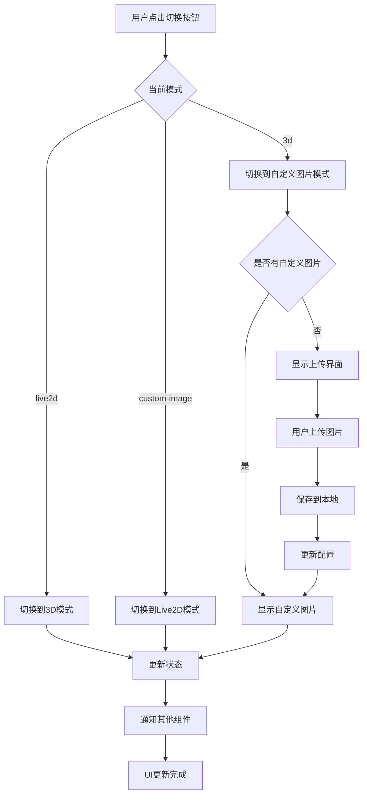

# 技术方案设计

## 技术架构概述

基于现有的Electron + React架构，扩展自定义图片模式功能。使用现有的ConfigService进行状态持久化，通过IPC通信实现主进程和渲染进程的文件操作。

## 技术栈

- **前端框架**: React 18 + TypeScript
- **桌面框架**: Electron 25
- **状态管理**: React useState + Context
- **文件处理**: Electron原生API + fs模块
- **配置存储**: 现有ConfigService (JSON配置文件)
- **IPC通信**: Electron IPC (ipcMain/ipcRenderer)

## 核心组件设计

### 1. 模式扩展 (Mode Extension)

#### 当前模式系统分析
- 现有模式: `'live2d' | '3d'`
- 切换机制: 通过CustomEvent在组件间通信
- 状态存储: 使用localStorage和ConfigService

#### 扩展设计
```typescript
// 扩展模式类型
type RenderMode = 'live2d' | '3d' | 'custom-image';

// 模式配置
interface ModeConfig {
  currentMode: RenderMode;
  customImage?: {
    imagePath: string;
    fileName: string;
    uploadTime: number;
  };
}
```

### 2. 文件上传与存储 (File Upload & Storage)

#### Electron主进程扩展
基于现有的`FileIpcHandler`，新增图片相关处理:

```typescript
// 新增IPC通道
- 'select-image-file': 打开文件选择对话框
- 'save-custom-image': 保存图片到本地目录  
- 'get-custom-image': 获取已保存的图片
- 'delete-custom-image': 删除自定义图片
```

#### 本地存储策略
```
应用数据目录/
├── config/
│   └── app-config.json (模式配置)
└── custom-images/
    └── user-uploaded.{ext} (用户上传图片)
```

#### 图片处理流程
1. 用户选择文件 → 验证格式 → 生成预览
2. 确认上传 → 复制到本地目录 → 更新配置
3. 启动恢复 → 读取配置 → 验证文件存在 → 显示图片

### 3. UI组件设计

#### CustomImageUploader组件
```typescript
interface CustomImageUploaderProps {
  onImageSelect: (imagePath: string) => void;
  onError: (error: string) => void;
}
```

功能:
- 拖拽上传支持
- 图片格式验证 (jpg, jpeg, png, gif, webp)
- 实时预览
- 上传进度指示

#### CustomImageViewer组件  
```typescript
interface CustomImageViewerProps {
  imagePath: string;
  style?: React.CSSProperties;
  onImageError: () => void;
}
```

功能:
- 响应式图片显示
- 保持宽高比
- 居中对齐
- 错误处理

### 4. 工具栏集成 (ToolBar Integration)

#### 按钮逻辑扩展
当前`3d-mode`按钮在Live2D和3D间切换，扩展为三态循环:
```
Live2D → 3D → 自定义图片 → Live2D (循环)
```

#### 图标和提示文本
```typescript
// 图标定义
const fa_custom_image = '<svg>...</svg>';

// 提示文本逻辑
getToolTip('mode-switch'): string {
  switch(currentMode) {
    case 'live2d': return '切换到3D模式';
    case '3d': return '切换到自定义图片模式'; 
    case 'custom-image': return '切换到Live2D模式';
  }
}
```

## 数据流设计

### 配置数据结构
```json
{
  "displayMode": {
    "currentMode": "custom-image",
    "customImage": {
      "imagePath": "/path/to/custom-images/user-uploaded.png",
      "fileName": "my-character.png",
      "uploadTime": 1672531200000
    }
  }
}
```

### 状态管理流程


## 文件操作安全策略

### 文件类型验证
```typescript
const ALLOWED_IMAGE_TYPES = [
  'image/jpeg', 'image/jpg', 'image/png', 
  'image/gif', 'image/webp'
];

const ALLOWED_EXTENSIONS = ['.jpg', '.jpeg', '.png', '.gif', '.webp'];
```

### 文件大小限制
- 最大文件大小: 10MB
- 推荐尺寸: 不超过1920x1080

### 路径安全
- 所有文件操作限制在应用数据目录内
- 使用path.resolve()防止路径遍历攻击
- 文件名sanitization

## 性能优化策略

### 图片加载优化
1. **懒加载**: 只有切换到自定义图片模式时才加载
2. **缓存策略**: 本地文件系统缓存
3. **压缩处理**: 可选的图片压缩功能

### 内存管理
1. **及时释放**: 切换模式时清理previous模式资源
2. **错误处理**: 图片加载失败时的fallback机制
3. **垃圾回收**: 定期清理无效的图片文件

## 错误处理策略

### 文件操作错误
- 文件不存在: 显示重新上传提示
- 文件损坏: 自动删除并提示重新上传  
- 权限错误: 提示用户检查文件权限

### 网络和系统错误
- 磁盘空间不足: 提示用户清理空间
- 系统IO错误: 降级到默认模式

## 测试策略

### 单元测试
- 文件操作函数测试
- 配置读写测试
- 组件渲染测试

### 集成测试  
- IPC通信测试
- 模式切换流程测试
- 文件上传下载测试

### 兼容性测试
- 不同操作系统 (macOS, Windows, Linux)
- 不同图片格式和尺寸
- 异常情况恢复测试

## 安全性考虑

### 文件安全
- 严格的文件类型检查
- 文件内容验证(防止恶意文件)
- 沙箱化文件访问

### 隐私保护
- 本地存储,不上传到服务器
- 用户数据加密存储选项
- 清理功能(删除用户数据)

## 兼容性保证

### 向后兼容
- 现有Live2D和3D模式保持不变
- 配置文件向后兼容
- API接口保持稳定

### 版本迁移
- 自动检测旧版本配置
- 平滑迁移到新配置格式
- 迁移失败时的回滚机制
