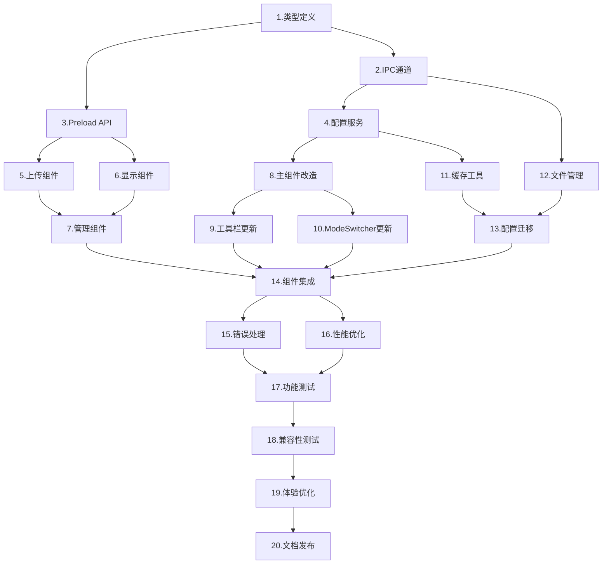

# 实施计划

## 任务概述
基于需求文档和技术方案，将自定义图片模式功能拆分为具体的实施任务，按照依赖关系有序执行。

## 第一阶段：基础架构扩展

- [ ] 1. 扩展模式类型定义
  - 修改 `packages/types/src/index.ts` 添加 `RenderMode` 类型定义
  - 更新相关TypeScript接口
  - 确保类型安全和向后兼容
  - _需求: 需求1_

- [ ] 2. 扩展Electron IPC通道
  - 在 `packages/electron/src/handlers/ipc/FileIpcHandler.ts` 中添加图片相关IPC处理
  - 实现 `select-image-file` 通道：打开文件选择对话框
  - 实现 `save-custom-image` 通道：保存图片到本地目录
  - 实现 `get-custom-image` 通道：获取已保存图片信息
  - 实现 `delete-custom-image` 通道：删除自定义图片
  - _需求: 需求2, 需求3_

- [ ] 3. 更新Electron preload API
  - 在 `packages/electron/src/preload.ts` 中暴露新的图片操作API
  - 确保渲染进程可以安全调用文件操作
  - 添加必要的类型定义
  - _需求: 需求2_

- [ ] 4. 扩展配置服务
  - 修改 `packages/electron/src/handlers/ipc/ConfigIpcHandler.ts` 支持模式配置
  - 在配置文件中添加 `displayMode` 配置项
  - 实现模式状态的持久化存储和恢复
  - _需求: 需求1, 需求3_

## 第二阶段：UI组件开发

- [ ] 5. 创建自定义图片上传组件
  - 创建 `packages/renderer/src/components/CustomImageUploader/index.tsx`
  - 实现文件拖拽上传功能
  - 添加图片格式验证和预览
  - 创建对应的样式文件
  - _需求: 需求2_

- [ ] 6. 创建自定义图片显示组件
  - 创建 `packages/renderer/src/components/CustomImageViewer/index.tsx`
  - 实现响应式图片显示
  - 添加图片加载错误处理
  - 确保保持透明背景
  - _需求: 需求4_

- [ ] 7. 创建图片管理组件
  - 创建图片重新上传功能
  - 实现图片删除确认对话框
  - 添加图片信息显示（文件名、上传时间等）
  - _需求: 需求5_

## 第三阶段：模式切换系统改造

- [ ] 8. 修改App.tsx主组件
  - 扩展 `currentMode` 状态为三种模式
  - 添加自定义图片模式的渲染逻辑
  - 实现启动时模式状态恢复
  - 添加模式切换事件监听
  - _需求: 需求1, 需求3_

- [ ] 9. 更新工具栏切换逻辑
  - 修改 `packages/renderer/src/components/ToolBar/index.tsx`
  - 将二态切换改为三态循环切换
  - 更新按钮图标和提示文本
  - 添加自定义图片模式的处理逻辑
  - _需求: 需求1_

- [ ] 10. 更新ModeSwitcher组件（如果使用）
  - 修改 `packages/renderer/src/components/ModeSwitcher/index.tsx`
  - 支持三种模式的切换
  - 更新性能监控逻辑
  - _需求: 需求1_

## 第四阶段：状态管理和持久化

- [ ] 11. 扩展缓存工具
  - 修改 `packages/renderer/src/utils/cache.ts`
  - 添加模式状态缓存支持
  - 实现自定义图片路径的本地存储
  - _需求: 需求3_

- [ ] 12. 实现图片文件管理
  - 创建应用数据目录下的 `custom-images` 文件夹
  - 实现图片文件的复制和删除
  - 添加文件完整性检查
  - 实现旧图片文件的清理机制
  - _需求: 需求3_

- [ ] 13. 添加配置迁移逻辑
  - 检测旧版本配置格式
  - 实现平滑升级到新配置格式
  - 添加配置验证和修复机制
  - _需求: 需求3_

## 第五阶段：集成和优化

- [ ] 14. 集成所有组件
  - 将自定义图片模式集成到主应用流程
  - 确保三种模式之间的平滑切换
  - 测试模式切换的完整流程
  - _需求: 需求1, 需求4_

- [ ] 15. 错误处理和用户体验
  - 添加图片加载失败的fallback机制
  - 实现友好的错误提示信息
  - 添加加载状态指示器
  - 优化用户交互体验
  - _需求: 需求2, 需求4, 需求5_

- [ ] 16. 性能优化
  - 实现图片懒加载
  - 添加内存使用监控
  - 优化大图片的显示性能
  - 实现图片缓存策略
  - _需求: 需求4_

## 第六阶段：测试和完善

- [ ] 17. 功能测试
  - 测试文件上传的各种场景
  - 测试模式切换的完整流程
  - 测试应用重启后的状态恢复
  - 测试异常情况的处理
  - _需求: 所有需求_

- [ ] 18. 兼容性测试
  - 测试不同图片格式的支持
  - 测试不同尺寸图片的显示效果
  - 确保现有功能不受影响
  - _需求: 需求4_

- [ ] 19. 用户体验优化
  - 优化上传流程的用户引导
  - 添加使用提示和帮助信息
  - 完善交互动画效果
  - _需求: 需求2, 需求5_

- [ ] 20. 文档和发布准备
  - 更新用户使用文档
  - 准备版本发布说明
  - 确保代码质量和规范
  - _需求: 所有需求_

## 技术依赖关系

## 估算时间

- **第一阶段**: 2-3小时（基础架构）
- **第二阶段**: 3-4小时（UI组件）
- **第三阶段**: 2-3小时（模式切换）
- **第四阶段**: 2-3小时（状态管理）
- **第五阶段**: 2-3小时（集成优化）
- **第六阶段**: 2-3小时（测试完善）

**总计**: 13-19小时

## 风险控制

1. **向后兼容性**: 确保现有Live2D和3D功能不受影响
2. **文件安全**: 严格验证上传文件的安全性
3. **性能影响**: 监控大图片对应用性能的影响
4. **错误恢复**: 确保任何异常都能优雅处理并恢复
