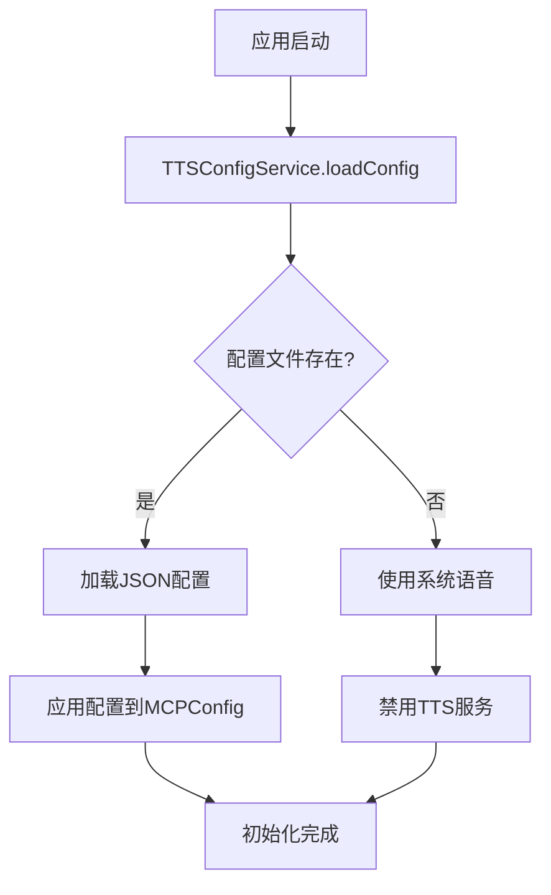
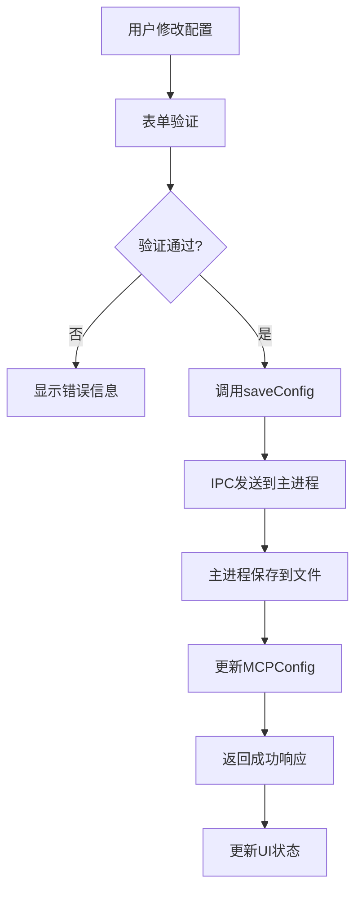

# 技术方案设计 - TTS配置管理系统

## 技术架构

### 整体架构
本方案基于现有的Electron + React + TypeScript架构，采用主进程-渲染进程分离的设计模式，通过IPC通信实现配置数据的管理。

```
┌─────────────────┐    IPC     ┌─────────────────┐
│   Renderer      │◄─────────►│   Main Process  │
│   (React UI)    │            │   (ConfigService)│
└─────────────────┘            └─────────────────┘
        │                              │
        ▼                              ▼
┌─────────────────┐            ┌─────────────────┐
│   Local State   │            │  JSON Config    │
│   Management    │            │    Storage      │
└─────────────────┘            └─────────────────┘
```

## 技术选型

### 前端技术栈
- **React 18** - 基于现有的函数组件架构
- **TypeScript** - 类型安全和代码提示
- **CSS Modules** - 样式隔离，与现有ToolBar保持一致
- **React Hooks** - useState, useEffect, useCallback用于状态管理

### 后端技术栈
- **Electron IPC** - 主进程与渲染进程通信
- **Node.js fs** - 配置文件读写
- **JSON** - 配置数据序列化格式

### 数据存储
- **配置文件路径**: `${userData}/tts-config.json`
- **配置数据结构**:
```typescript
interface TTSConfig {
  enabled: boolean;
  hostname: string;
  port: number;
  path: string;
  audioUrl: string;
  promptText: string;
  lastModified: number;
}
```

## 系统设计

### 组件设计

#### 1. TTSConfigButton (工具栏按钮)
- **位置**: `packages/renderer/src/components/ToolBar/index.tsx`
- **功能**: 添加TTS配置按钮到现有工具栏
- **图标**: 使用SVG图标，风格与现有按钮一致

#### 2. TTSConfigPanel (配置面板)
- **路径**: `packages/renderer/src/components/TTSConfigPanel/index.tsx`
- **功能**: TTS配置管理的主界面
- **样式**: 参考VoiceSettings组件的设计风格
- **特性**:
  - 表单验证
  - 实时错误提示
  - 测试功能
  - 保存/重置操作

#### 3. TTSConfigService (服务层)
- **路径**: `packages/renderer/src/services/TTSConfigService.ts`
- **功能**: 封装IPC通信和配置管理逻辑
- **方法**:
  - `loadConfig(): Promise<TTSConfig>`
  - `saveConfig(config: TTSConfig): Promise<void>`
  - `testConnection(config: TTSConfig): Promise<boolean>`
  - `resetConfig(): Promise<void>`

### 数据流设计

#### 配置加载流程


#### 配置保存流程


### IPC接口设计

#### 主进程处理器扩展
在 `packages/electron/src/handlers/ipc/ConfigIpcHandler.ts` 中添加：

```typescript
// TTS配置相关IPC处理
'tts-config-load': async () => Promise<TTSConfig | null>
'tts-config-save': async (config: TTSConfig) => Promise<void>
'tts-config-test': async (config: TTSConfig) => Promise<{success: boolean, message: string}>
'tts-config-reset': async () => Promise<void>
```

#### 渲染进程API封装
在 `packages/renderer/src/services/TTSConfigService.ts` 中封装：

```typescript
class TTSConfigService {
  async loadConfig(): Promise<TTSConfig | null> {
    return window.electronAPI.invoke('tts-config-load');
  }
  
  async saveConfig(config: TTSConfig): Promise<void> {
    return window.electronAPI.invoke('tts-config-save', config);
  }
  
  async testConnection(config: TTSConfig): Promise<{success: boolean, message: string}> {
    return window.electronAPI.invoke('tts-config-test', config);
  }
  
  async resetConfig(): Promise<void> {
    return window.electronAPI.invoke('tts-config-reset');
  }
}
```

## 配置管理策略

### 配置文件结构
```json
{
  "enabled": true,
  "hostname": "example.com",
  "port": 8443,
  "path": "/voice_clone_direct",
  "audioUrl": "https://example.com/audio.wav",
  "promptText": "测试语音内容",
  "lastModified": 1703847123456
}
```

### 配置验证规则
- **hostname**: 域名或IP地址格式验证
- **port**: 1-65535范围验证
- **path**: URL路径格式验证（以/开头）
- **audioUrl**: HTTP/HTTPS URL格式验证
- **promptText**: 非空字符串，长度限制500字符

### 错误处理策略
1. **配置文件损坏**: 备份损坏文件，创建新配置
2. **网络连接失败**: 显示具体错误信息，提供重试选项
3. **权限问题**: 提示用户检查文件权限
4. **格式错误**: 实时验证，阻止提交

## 界面设计

### 视觉风格
- **主题色**: 继承应用主题色
- **背景**: 毛玻璃效果 `backdrop-filter: blur(15px)`
- **边框**: `border-radius: 12px`，与VoiceSettings保持一致
- **动画**: 300ms缓动过渡效果

### 响应式设计
- **弹窗宽度**: 固定450px
- **最大高度**: 80vh，超出时显示滚动条
- **移动端适配**: 全屏显示（如需要）

### 无障碍设计
- **键盘导航**: Tab键顺序导航
- **屏幕阅读器**: aria-label标签
- **颜色对比度**: 符合WCAG 2.1 AA标准

## 测试策略

### 单元测试
- 配置验证函数测试
- IPC通信模拟测试
- 组件渲染测试

### 集成测试
- 端到端配置保存/加载测试
- TTS连接测试
- 界面交互测试

### 性能测试
- 配置加载时间 < 100ms
- 界面响应时间 < 50ms
- 内存占用监控

## 安全性考虑

### 输入验证
- 前端表单验证
- 后端二次验证
- XSS防护

### 文件安全
- 配置文件权限控制
- 敏感信息加密存储（如需要）
- 备份机制

## 扩展性设计

### 配置模板
- 支持预设配置模板
- 导入/导出配置功能
- 配置版本管理

### 插件化
- 支持多种TTS服务提供商
- 配置校验插件
- 自定义UI主题

## 部署和维护

### 版本兼容性
- 向后兼容旧配置格式
- 配置迁移脚本
- 版本检查机制

### 监控和日志
- 配置操作日志记录
- 错误监控和上报
- 性能指标收集