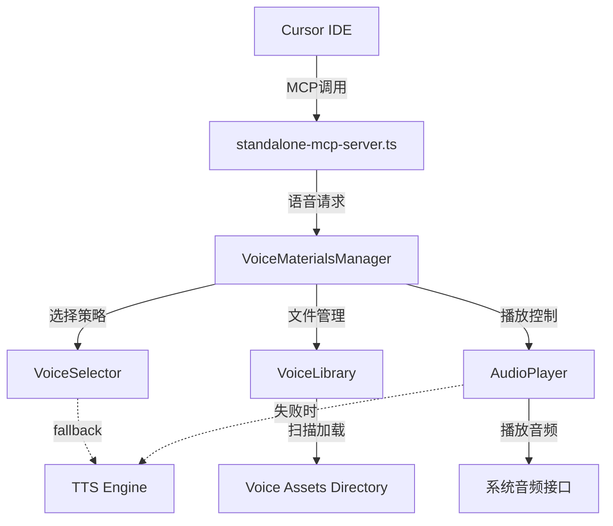

# 技术方案设计

## 技术架构

### 整体架构



## 技术栈

- **语音文件格式**: MP3, WAV, OGG
- **音频播放**: Node.js child_process + 系统音频命令
- **文件管理**: fs, path (Node.js内置模块)
- **配置管理**: JSON配置文件
- **语音分类**: 基于文件名和配置的标签系统

## 核心组件设计

### 1. VoiceMaterialsManager (核心管理器)

```typescript
class VoiceMaterialsManager {
  private voiceLibrary: VoiceLibrary;
  private voiceSelector: VoiceSelector;
  private audioPlayer: AudioPlayer;
  private ttsEngine: TTSEngine;
  private projectAnalyzer: ProjectAnalyzer;
  private config: VoiceConfig;
  
  async playCompletionVoice(urgency: string, message?: string): Promise<boolean>
  async playProjectSummary(): Promise<boolean>
  async switchVoiceMode(mode: 'fixed' | 'tts' | 'mixed'): Promise<void>
  async reloadVoiceLibrary(): Promise<void>
  async getAvailableVoices(): Promise<VoiceItem[]>
}
```

### 2. VoiceLibrary (语音资源库)

```typescript
interface VoiceItem {
  id: string;
  name: string;
  filePath: string;
  category: 'normal' | 'high' | 'low';
  tags: string[];
  duration?: number;
}

class VoiceLibrary {
  async loadVoices(directory: string): Promise<VoiceItem[]>
  async validateVoiceFile(filePath: string): Promise<boolean>
  getCategorizedVoices(category: string): VoiceItem[]
}
```

### 3. VoiceSelector (选择策略)

```typescript
class VoiceSelector {
  selectByUrgency(urgency: string, availableVoices: VoiceItem[]): VoiceItem | null
  selectRandom(voices: VoiceItem[]): VoiceItem | null
  selectByPreference(preference: string, voices: VoiceItem[]): VoiceItem | null
}
```

### 4. AudioPlayer (音频播放器)

```typescript
class AudioPlayer {
  async playVoiceFile(filePath: string): Promise<boolean>
  async testVoiceFile(filePath: string): Promise<boolean>
  isSupported(filePath: string): boolean
}
```

### 5. TTSEngine (TTS引擎)

```typescript
interface TTSConfig {
  voice: string;
  speed: number;
  pitch: number;
  volume: number;
  language: 'zh-CN' | 'en-US';
}

class TTSEngine {
  private config: TTSConfig;
  
  async generateSpeech(text: string, options?: Partial<TTSConfig>): Promise<string>
  async playText(text: string, options?: Partial<TTSConfig>): Promise<boolean>
  async getAvailableVoices(): Promise<string[]>
  isSupported(): boolean
}
```

### 6. ProjectAnalyzer (项目分析器)

```typescript
interface ProjectSummary {
  projectName: string;
  filesModified: number;
  mainChanges: string[];
  currentTask?: string;
  recentActivity: string;
  estimatedTime: string;
}

class ProjectAnalyzer {
  async analyzeCurrentProject(): Promise<ProjectSummary>
  async getRecentChanges(timespan?: string): Promise<string[]>
  async extractTaskInfo(): Promise<string | null>
  async generateSummaryText(summary: ProjectSummary): Promise<string>
}
```

## 数据库/文件设计

### 语音素材目录结构

```
packages/renderer/public/assets/voice/
├── completion/                 # 完成提示语音
│   ├── normal/                # 普通情绪
│   │   ├── completion_01.mp3
│   │   ├── completion_02.mp3
│   │   └── completion_03.mp3
│   ├── excited/               # 兴奋情绪
│   │   ├── great_job_01.mp3
│   │   └── excellent_01.mp3
│   └── calm/                  # 平静情绪
│       ├── done_01.mp3
│       └── finished_01.mp3
├── config.json               # 语音配置文件
└── voice-manifest.json       # 语音清单文件
```

### 配置文件格式

```json
{
  "voices": {
    "completion_01": {
      "name": "标准完成",
      "file": "completion/normal/completion_01.mp3",
      "category": "normal",
      "tags": ["standard", "completion"],
      "weight": 1.0
    }
  },
  "settings": {
    "enableVoiceNotification": true,
    "voiceMode": "mixed",
    "preferredCategory": "normal",
    "selectionMode": "random",
    "fallbackToTTS": true,
    "enableProjectSummary": true,
    "summaryMaxLength": 30
  },
  "tts": {
    "voice": "Ting-Ting",
    "speed": 1.0,
    "pitch": 1.0,
    "volume": 0.8,
    "language": "zh-CN"
  },
  "projectAnalysis": {
    "enabled": true,
    "includeFileCount": true,
    "includeTaskInfo": true,
    "timespan": "1h",
    "summaryTemplate": "项目 {projectName}，最近修改了 {filesModified} 个文件，主要改动：{mainChanges}"
  }
}
```

## 接口设计

### MCP工具接口扩展

```typescript
// 扩展现有的conversation_complete工具
{
  name: 'conversation_complete',
  inputSchema: {
    properties: {
      message: { type: 'string' },
      type: { enum: ['voice', 'sound', 'notification', 'all'] },
      urgency: { enum: ['low', 'normal', 'high'] },
      voiceMode: { enum: ['fixed', 'tts', 'mixed'], description: '语音模式' },
      voiceStyle: { type: 'string', description: '指定语音风格' },
      usePreset: { type: 'boolean', description: '是否使用预设语音' },
      includeProjectSummary: { type: 'boolean', description: '是否包含项目总结' },
      customText: { type: 'string', description: '自定义TTS文本内容' }
    }
  }
}

// 新增项目总结工具
{
  name: 'project_summary_voice',
  inputSchema: {
    properties: {
      includeFileCount: { type: 'boolean', default: true },
      includeTaskInfo: { type: 'boolean', default: true },
      timespan: { type: 'string', default: '1h', description: '分析时间范围' },
      voiceMode: { enum: ['tts', 'fixed'], default: 'tts' },
      urgency: { enum: ['low', 'normal', 'high'], default: 'normal' }
    }
  }
}

// 新增语音模式切换工具
{
  name: 'switch_voice_mode',
  inputSchema: {
    properties: {
      mode: { enum: ['fixed', 'tts', 'mixed'], description: '目标语音模式' },
      persistent: { type: 'boolean', default: true, description: '是否永久保存设置' }
    }
  }
}
```

## 测试策略

### 单元测试
- VoiceLibrary 文件扫描和验证
- VoiceSelector 选择逻辑
- AudioPlayer 播放功能

### 集成测试
- MCP工具端到端调用
- 语音文件播放完整流程
- 错误处理和fallback机制

### 用户测试
- 不同urgency级别的语音效果
- 随机选择的多样性
- 配置修改的即时生效

## 安全性

- 文件路径验证，防止路径遍历攻击
- 音频文件格式验证，防止恶意文件执行
- 配置文件校验，防止配置注入
- 音频播放权限控制

## 性能考虑

- 语音文件预加载机制
- 文件系统缓存策略
- 异步音频播放，避免阻塞
- 大文件的延迟加载

## 扩展性

- 支持自定义语音包
- 可插拔的选择策略
- 多语言语音支持
- 外部语音源集成（如在线TTS服务）